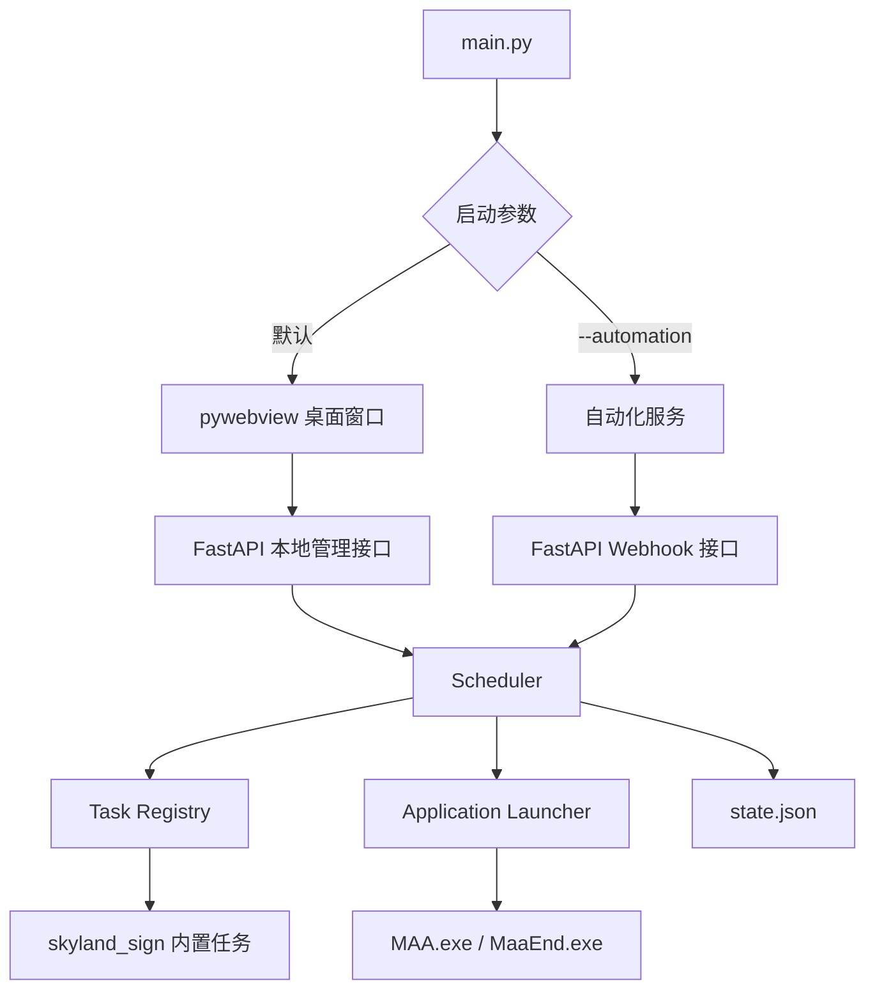

# AutoGame 项目架构说明

本文档按照当前代码实现编写，描述文件职责、主要类和公共函数职责、任务状态、配置保存以及两种启动模式。

## 1. 总体结构



系统是单进程结构。FastAPI 不是独立 Web 产品，而是 pywebview 页面、桌面管理接口和 MAA 回调的本地通信层。

## 2. 启动流程

### 2.1 桌面模式

执行 `python main.py`：

1. 迁移旧配置（如果发现旧入口字段）；
2. 加载并校验 `config.yaml`；
3. 配置 Loguru；
4. `DesktopBackend` 在后台线程启动本地 Uvicorn；
5. 创建 `Scheduler(auto_schedule=False, auto_shutdown=False)`；
6. 打开 pywebview 的 `/ui/` 页面；
7. 页面点击后调用管理 API，Scheduler 才启动任务；
8. 关闭窗口后停止本地服务。

桌面模式绝不会调用自动任务轮询，因此打开软件不会自动启动脚本。

### 2.2 自动化模式

执行 `python main.py --automation`：

1. 启动 `Scheduler(auto_schedule=True, auto_shutdown=True)`；
2. 启动 FastAPI，继续接收 MAA 回调；
3. `poll_loop()` 每 30 秒检查 `interval_hours`；
4. 启动到期任务；
5. `timeout_watchdog()` 监控整次自动化运行；
6. 全部本次任务完成后执行全局完成动作。

## 3. 配置模型

### 3.1 `core/common.py`

- `SystemConfig`：日志、端口、超时、电源动作、SendKey；
- `LauncherConfig`：启动类型、应用路径、进程名、启动验证超时和旧进程处理策略；
- `TaskConfig`：任务启用开关、间隔小时和启动器；
- `Config.load()`：读取 YAML 并使用 Pydantic 校验。

任务不再从 YAML 接受 Python 入口字符串。配置只描述运行参数，业务行为由任务注册表决定。

### 3.2 配置迁移和保存

`core/config_store.py`：

- `ConfigStore.revision()`：计算配置文件 SHA-256 版本；
- `ConfigStore.load()`：读取当前正式配置；
- `ConfigStore.update_task()`：保存任务配置；
- `ConfigStore.update_system()`：保存全局配置；
- `迁移旧版配置()`：将旧 `entry/start_on/done_on` 转换为 `launcher`。

保存顺序：文件锁 → 版本校验 → 读取 YAML → Pydantic 校验 → 写入 `.bak` → 临时文件写入 → 原子替换 → 重新加载。

迁移规则：

- `skyland_sign` 使用 `launcher.type=none`；
- `maa` 使用 MAA 快捷方式和 `MAA.exe`；
- `maaend` 使用 MaaEnd 快捷方式和 `MaaEnd.exe`；
- 未知非空入口拒绝自动迁移。

## 4. 任务执行和状态

### 4.1 `core/task_registry.py`

- `TaskDefinition`：保存任务名、完成信号和内置执行函数；
- `get_task_definition()`：返回注册任务定义；
- `skyland_sign` 注册为内置执行，返回成功后完成；
- `maa` 注册为等待 POST `/maa`；
- `maaend` 注册为等待 GET `/maa`。

### 4.2 `core/launcher.py`

- `启动并验证()`：异步调用应用启动验证；
- `_启动并验证同步()`：检查路径，默认停止同名旧进程，启动 exe/lnk，并在超时时间内使用 psutil 检查启动后的新进程。

默认 `restart_existing=true`，因此同名旧进程不会被误判为本次启动成功；旧进程停止后仍未出现新的目标进程，任务会失败。只有显式设置 `restart_existing=false` 时才复用已有进程。

### 4.3 `core/scheduler.py`

`Scheduler` 的主要职责：

- `get_status_snapshot()`：生成页面和 API 使用的状态快照；
- `update_task_config()`：保存并应用任务配置；
- `update_system_config()`：保存全局配置并热更新日志级别；
- `reload_config()`：重新加载磁盘配置；
- `should_run()`：按启用状态和间隔小时判断是否到期；
- `run_task()`：执行内置任务或启动应用；
- `mark_done()`：将运行中的任务标记为完成或失败；
- `poll_loop()`：自动化模式周期扫描；
- `timeout_watchdog()`：自动化超时监控。

状态流转：

```text
pending -> starting -> running -> completed
starting -> failed
running -> failed
running -> timed_out
completed -> cooldown -> pending
```

MAA 等待回调时不新增公开状态，而是保持 `running` 并设置 `waiting_for_callback=true`。

持久化的 `state.json` 只保存每个任务最后一次成功完成时间，临时运行状态保存在 Scheduler 内存中。

## 5. FastAPI 接口

`webhook/listener.py` 的主要接口：

| 方法 | 路径 | 作用 |
|---|---|---|
| POST | `/trigger` | 外部触发任务 |
| POST | `/maa` | MAA 完成回调并完成 `maa` |
| GET | `/maa` | MaaEnd 完成回调并完成 `maaend` |
| GET | `/api/status` | 返回状态和脱敏全局配置 |
| POST | `/api/tasks/{task_name}/run` | 页面手动运行任务 |
| PATCH | `/api/tasks/{task_name}` | 保存任务配置 |
| PATCH | `/api/config/system` | 保存全局配置 |
| POST | `/api/config/reload` | 重新加载配置 |
| GET | `/api/logs/recent` | 返回最近主日志 |

`/api/*` 只允许本机访问。SendKey 只在 Scheduler 内部用于推送，状态响应只返回 `server_chan_key_configured` 布尔值。

## 6. 桌面页面

### `web/index.html`

提供任务、日志、设置三个区域。设置区域包含全部可运行全局配置，并提示端口重启后生效。

### `web/app.js`

- 状态文字和颜色映射；
- 任务列表、状态详情和运行按钮；
- 任务启用、间隔和启动器编辑；
- 全局配置读取和保存；
- 日志读取和定时状态刷新。

### `web/app.css`

提供深色桌面管理界面布局、状态标签、任务表格、详情面板和全局设置表单样式。

## 7. 日志和通知

### `core/logger.py`

- `configure_logging()`：配置控制台、主日志和通知日志；
- `_清理旧日志()`：删除超过七天的日志文件；
- `_配置标准库日志()`：将 Uvicorn、FastAPI 等标准日志转发到 Loguru；
- `mlog`：项目主日志对象；
- `notify_logger`：通知日志对象。

日志文件为 `logs/YYYY-MM-DD.log` 和 `logs/notify-YYYY-MM-DD.log`，按天轮转并保留七天。

### `core/notify.py`

- `report()`：保存任务报告并写通知日志；
- `notify_wrapper()`：生成带标题的通知文本；
- `push_wechat()`：通过 Server 酱推送本次报告。

## 8. 文件职责

| 文件 | 职责 |
|---|---|
| `main.py` | 解析 `--automation`，迁移配置并选择启动模式 |
| `core/common.py` | 配置模型和 YAML 读取 |
| `core/config_store.py` | 配置保存、备份、版本冲突和迁移 |
| `core/status.py` | 任务状态类型和运行时数据结构 |
| `core/task_registry.py` | 内置任务注册和完成信号 |
| `core/launcher.py` | Windows 应用启动与进程验证 |
| `core/scheduler.py` | 调度、执行、状态、重载和超时 |
| `core/logger.py` | Loguru 配置和七日清理 |
| `core/notify.py` | 任务报告和 Server 酱通知 |
| `desktop/app.py` | 后台 Uvicorn 生命周期和 pywebview 窗口 |
| `webhook/listener.py` | FastAPI 静态页面、管理 API 和回调 |
| `web/index.html` | 页面结构和中文文案 |
| `web/app.js` | 页面状态、操作和配置保存逻辑 |
| `web/app.css` | 页面样式 |
| `tasks/skyland_sign/skyland.py` | 森空岛签到业务实现 |
| `tasks/maa.py` | 旧版 MAA 兼容文件，新的执行入口由注册表和启动器负责 |
| `tasks/maaend.py` | 旧版 MaaEnd 兼容文件，新的执行入口由注册表和启动器负责 |
| `scripts/register-autogame-task.ps1` | 注册 Windows 自动化任务 |
| `tests/test_refactor.py` | 配置、迁移、状态和 API 测试 |

## 9. 扩展新任务

1. 在 `core/task_registry.py` 增加固定的 `TaskDefinition`；
2. 内置任务使用 `launcher.type=none`，外部程序使用 `application`；
3. 如果需要外部完成通知，在 `webhook/listener.py` 增加明确的回调适配；
4. 在 `config.example.yaml` 增加配置示例；
5. 为启动验证、完成回调、重复回调和失败路径增加测试。

不允许通过 YAML 填写任意 Python 模块和函数路径。
