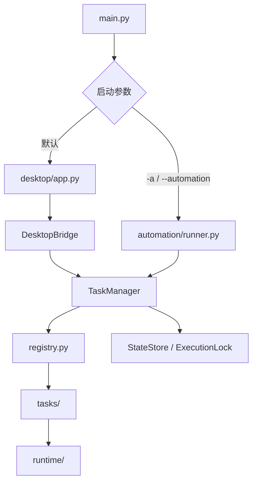

# AutoGame 项目架构说明

本文档按照当前代码实现编写。代码标识符使用英文，中文用于页面、日志、注释和文档。文档只说明主要类和公共函数，不展开模块内部辅助函数。

`autogame/` 是应用内部 Python 包，用于建立清晰的模块边界，不表示项目必须发布为第三方软件包。普通用户仍然通过根目录的 `main.py` 启动程序。

## 1. 目录结构

```text
D:\project\autogame
├── main.py                         # 唯一命令入口
├── config.yaml                     # 当前电脑正式配置
├── config.example.yaml             # 配置模板
├── autogame/
│   ├── config.py                   # 用户配置模型和应用路径
│   ├── config_store.py             # 配置安全保存
│   ├── models.py                   # 任务运行状态
│   ├── registry.py                 # 受信任任务注册表
│   ├── task_manager.py             # 共享任务生命周期核心
│   ├── logger.py                   # Loguru 配置
│   ├── notify.py                   # 会话报告和 Server 酱推送
│   ├── automation/
│   │   └── runner.py               # 无界面自动化会话
│   ├── desktop/
│   │   ├── app.py                  # pywebview 和后台事件循环
│   │   ├── bridge.py               # JavaScript 到 Python 的受控接口
│   │   └── ui/
│   │       ├── index.html          # 中文页面结构
│   │       ├── app.js              # 状态展示和页面操作
│   │       └── app.css             # 页面样式
│   ├── runtime/
│   │   ├── process.py              # Windows 进程管理
│   │   ├── log_reader.py           # 外部日志增量读取
│   │   ├── state_store.py          # 状态文件原子保存
│   │   ├── execution_lock.py       # 跨进程执行锁
│   │   └── power.py                # Windows 电源操作
│   └── tasks/
│       ├── base.py                 # 任务协议和公共结果模型
│       ├── process_script.py       # 通用外部脚本任务
│       ├── maa.py                  # MAA 固定规则
│       ├── maaend.py               # MaaEnd 固定规则和日志解析
│       └── skyland_sign/
│           ├── adapter.py          # 森空岛生命周期适配
│           ├── service.py          # 多账号签到业务
│           ├── client.py           # 森空岛 HTTP 客户端
│           ├── token_store.py      # Token 读取和保存
│           └── security_sm.py      # 设备标识签名实现
├── data/                           # 本地运行数据，不提交版本库
│   ├── state.json                  # 最近成功时间
│   ├── locks/                      # 自动化和任务锁文件
│   └── skyland_sign/token.txt      # 森空岛 Token
└── scripts/                        # Windows 计划任务维护脚本
```

源码只存在于 `autogame/`。配置、状态、Token、锁和日志均不放入源码包。

## 2. 依赖关系



依赖方向是单向的：

- 桌面和自动化都依赖 `TaskManager`；
- `TaskManager` 不导入桌面或自动化；
- 自动化模式不导入 pywebview；
- 任务模块通过 `runtime/` 使用进程、日志和锁能力；
- `runtime/` 不知道具体任务名称。

## 3. 启动流程

### 3.1 `main.py`

主要函数：

- `main()`：解析启动参数、加载 `config.yaml`、配置日志，并按需导入桌面或自动化入口。

桌面模块使用延迟导入，因此自动化模式没有 pywebview 运行时依赖。

### 3.2 桌面模式

执行：

```powershell
uv run --extra desktop python main.py
```

流程：

```text
读取配置 -> 配置 Loguru -> 创建 TaskManager
-> 启动后台监控事件循环 -> 加载本地 HTML
-> 页面通过 DesktopBridge 操作 TaskManager
```

桌面启动时不会调用 `run_task()`，不会扫描到期任务，也不会执行自动化电源策略。关闭窗口时，后台会停止本次由 AutoGame 启动且仍在运行的脚本。

### 3.3 自动化模式

执行：

```powershell
uv run python main.py -a
```

流程：

```text
获取自动化实例锁 -> 创建 TaskManager -> 计算本次到期任务
-> 并发启动任务和监控循环 -> 等待全部进入终态
-> 超时时停止本次脚本 -> 汇总通知
-> 有到期任务时按配置强制执行完成动作 -> 退出
```

自动化只在进程启动时扫描一次到期任务。每天 07:00 和 19:00 的触发由 Windows 计划任务负责。

## 4. 任务状态

公开状态：

```text
disabled
cooldown
pending
starting
running
completed
failed
timed_out
```

主要流转：

```text
pending -> starting -> running -> completed
pending -> starting -> completed
starting -> failed
running -> failed
running -> timed_out
completed -> cooldown -> pending
```

`data/state.json` 只保存任务最近成功时间。活动进程、日志偏移和临时错误保存在当前进程内存中。

## 5. 核心类和公共函数

### 5.1 `autogame/config.py`

- `AppPaths`：集中计算配置、日志、数据、状态、锁和 Token 路径；
- `AppPaths.default()`：返回当前项目根目录对应的路径；
- `SystemConfig`：日志级别、分钟级自动化超时、Server 酱通知开关和完成动作策略；
- `TaskConfig`：任务启用状态、执行间隔和脚本路径；
- `Config`：完整用户配置和内部路径集合；
- `Config.load()`：从 YAML 读取并严格校验配置。

项目不再包含 `webhook_port` 或其他 HTTP 服务配置。

### 5.2 `autogame/config_store.py`

- `ConfigConflictError`：表示页面提交使用了过期配置版本；
- `ConfigStore`：负责配置文件锁、注释保留、校验、备份和原子替换；
- `ConfigStore.revision()`：计算当前配置的 SHA-256；
- `ConfigStore.load()`：重新读取正式配置；
- `ConfigStore.update_task()`：更新指定任务的允许字段；
- `ConfigStore.update_system()`：更新允许修改的系统字段。

保存流程：

```text
文件锁 -> SHA-256 检查 -> 合并补丁 -> Pydantic 校验
-> 创建 config.yaml.bak -> 写临时文件 -> 原子替换 -> 重新加载
```

### 5.3 `autogame/models.py`

- `TaskState`：任务公开状态集合；
- `TaskRuntime`：保存当前状态、开始时间、结束时间、最近成功时间和错误；
- `TaskRuntime.elapsed_seconds()`：计算本次任务耗时；
- `TaskRuntime.as_dict()`：生成桌面展示使用的字典；
- `format_datetime()`：把内部时间转换为 UTC ISO 字符串。

### 5.4 `autogame/registry.py`

- `TaskDefinition`：保存任务名、任务工厂、描述和是否需要脚本路径；
- `TASK_DEFINITIONS`：当前受信任任务注册表；
- `get_task_definition()`：按名称返回任务定义。

YAML 不能指定任意 Python 模块或函数，用户只能运行代码注册表中的任务。

### 5.5 `autogame/task_manager.py`

`TaskManager` 是桌面和自动化共享的生命周期核心。

主要公共方法：

- `active_task_names`：返回当前进程管理的活动任务；
- `get_status_snapshot()`：生成桌面需要的任务、进度和安全系统配置；
- `update_task_config()`：保存并应用任务配置；
- `update_system_config()`：保存系统配置并热更新日志级别；
- `reload_config()`：重新读取正式配置；
- `should_run()`：判断任务是否启用且已超过冷却；
- `get_task_state()`：返回指定任务状态；
- `get_task_result()`：返回任务状态、耗时、错误和可推送业务摘要；
- `run_task()`：取得跨进程任务锁并启动任务；
- `poll_active_tasks()`：轮询一次全部活动任务；
- `monitor_loop()`：持续运行任务监控；
- `wait_for_tasks()`：等待指定任务集合进入终态；
- `timeout_tasks()`：停止并标记超时任务；
- `shutdown()`：停止当前进程启动的脚本并释放锁。

`TaskManager` 不负责决定自动化何时开始，也不执行系统电源操作。

## 6. 任务实现

### 6.1 `autogame/tasks/base.py`

- `TaskContext`：保存任务名、用户配置和启动时间；
- `TaskContext.script_path`：返回用户配置的脚本路径；
- `AdapterResult`：表示当前检查结果、展示消息和可推送业务摘要；
- `StartResult`：表示启动结果和后续监控句柄；
- `TaskAdapter`：规定 `start()`、`poll()`、`stop()` 生命周期。

### 6.2 `autogame/tasks/process_script.py`

- `ProcessScriptSpec`：定义脚本进程、游戏进程、日志规则、启动等待和完成模式；
- `TaskLogLine`：保存清洗后的业务日志及是否进入推送；
- `ProcessRun`：保存一次外部脚本运行的进程与日志状态；
- `LogObservation`：保存一次增量日志解析结果；
- `ProcessScriptAdapter.start()`：建立日志基线，启动游戏，等待就绪后启动脚本；
- `ProcessScriptAdapter.poll()`：读取新增日志并检查脚本进程；
- `ProcessScriptAdapter.stop()`：停止本次 AutoGame 启动的脚本进程树；
- `ProcessScriptAdapter.observe_logs()`：提供可由具体任务覆盖的日志观察入口。

游戏进程可以复用。脚本启动前只关闭可执行文件路径完全相同的旧实例，然后重新启动；其他目录下的同名进程不会被关闭。

### 6.3 MAA

`MaaAdapter` 固定以下规则：

- 启动 MuMu 并验证 `MuMuNxDevice.exe`；
- 新启动游戏时等待 20 秒；
- 启动用户配置的 `MAA.exe`；
- 只读取脚本目录下 `debug/gui.log`；
- 只展示完成、跳过、出错、整轮完成和专精等级信息；
- 清除 MAA 自带日志前缀并合并跨行专精信息；
- “任务出错”以 `[ERR]` INFO 日志展示，不改变任务结果；
- 检测“任务已全部完成”后立即完成；
- 完成标记缺失或脚本异常退出时标记失败。

### 6.4 MaaEnd

`MaaEndAdapter` 固定以下规则：

- 启动终末地并验证 `Endfield.exe`；
- 新启动游戏时等待 20 秒；
- 启动用户配置的 `MaaEnd.exe`；
- 读取 `debug/maafw.log`、`debug/maafw*.log` 和 `debug/go-service.log`；
- `observe_logs()` 将任务事件和物资过程转换为中文展示日志；
- 识别“结束进程”任务的开始和成功事件；
- 结束进程任务成功，或该任务开始后脚本退出时完成；
- 已有有效业务日志且连续十分钟无更新时按静默规则完成。

### 6.5 森空岛

- `SkylandSignAdapter`：把内置签到转换为统一任务结果；
- `run_sign_in()`：读取全部账号并执行多账号签到；
- `SignInResult`：保存总体成功状态和通知消息；
- `SkylandClient`：换取凭据、读取绑定角色并调用签到接口；
- `SkylandClient.sign_all()`：签到当前账号全部支持角色；
- `TokenStore.load()`：优先读取 `TOKEN` 环境变量，否则读取本地文件；
- `TokenStore.save()`：保存去重后的 Token；
- `TokenStore.is_configured()`：判断 Token 是否存在；
- `TokenStore.parse()`：解析网页账号 JSON 或纯 Token；
- `get_d_id()`：生成森空岛接口需要的设备标识。

森空岛业务不再直接访问项目根目录，也不负责调度状态。

## 7. 运行能力

### 7.1 `autogame/runtime/process.py`

- `ProcessHandle`：保存 PID、进程名、创建时间、进程归属和是否重启旧实例；
- `find_processes()`：按名称查找进程，可进一步要求可执行文件路径完全匹配；
- `process_is_running()`：同时校验 PID、名称和创建时间；
- `start_process()`：按策略关闭同路径旧实例，启动 exe 或快捷方式并验证目标进程；
- `start_process_async()`：在线程池执行进程启动；
- `stop_process_tree()`：只停止本次 AutoGame 拥有的进程树。

### 7.2 `autogame/runtime/log_reader.py`

- `IncrementalLogReader`：根据文件偏移读取一个或多个日志模式；
- `prime()`：记录当前文件末尾，避免读取历史任务结果；
- `read_lines()`：返回基线之后新增的完整日志行。

### 7.3 `autogame/runtime/state_store.py`

- `StateStore`：管理 `data/state.json`；
- `load()`：读取有效任务成功时间；
- `record_success()`：加锁、合并并原子保存成功时间。

### 7.4 `autogame/runtime/execution_lock.py`

- `ExecutionLock`：创建具名跨进程文件锁；
- `ExecutionLock.acquire()`：立即尝试获取锁，冲突时返回 `None`；
- `ExecutionLease`：表示当前持有的锁；
- `ExecutionLease.release()`：安全释放锁。

锁分为：

- `automation-instance`：防止两个自动化会话同时运行；
- `task-{name}`：防止桌面和自动化重复启动同一任务。

### 7.5 `autogame/runtime/power.py`

- `PowerController`：封装 Windows 电源操作；
- `PowerController.execute()`：异步等待配置延迟并执行关机、睡眠、休眠或不操作。

## 8. 桌面层

### 8.1 `autogame/desktop/app.py`

- `DesktopBackend`：在独立线程中运行任务监控事件循环；
- `DesktopBackend.start()`：启动后台事件循环；
- `DesktopBackend.call()`：在线程安全的前提下调用同步管理方法；
- `DesktopBackend.submit()`：提交异步任务；
- `DesktopBackend.stop()`：停止监控和当前进程拥有的任务；
- `run_desktop_app()`：创建 pywebview 窗口并管理完整桌面生命周期。

### 8.2 `autogame/desktop/bridge.py`

`DesktopBridge` 是页面唯一能调用的 Python 接口：

- `get_status()`：读取状态；
- `run_task()`：手动或强制运行任务；
- `update_task_config()`：保存任务配置；
- `update_system_config()`：保存系统配置并保护 SendKey；
- `reload_config()`：重载配置；
- `get_recent_logs()`：读取近期项目日志。

页面通过 `window.pywebview.api` 调用这些方法，不经过 HTTP、端口或 Webhook。

## 9. 自动化层

### `autogame/automation/runner.py`

- `AutomationRunner`：负责一次无界面自动化会话；
- `AutomationRunner.run()`：获取实例锁、并发启动到期任务、处理分钟级超时、汇总通知，并在有到期任务时按配置强制执行完成动作；
- `run_automation()`：创建并运行自动化会话。

自动化层只负责策略，任务启动和状态变化仍由 `TaskManager` 完成。

## 10. 日志和通知

### `autogame/logger.py`

- `configure_logging()`：配置控制台、主日志、通知日志、标准日志转发和七日保留；
- `mlog`：项目主日志对象；
- `notify_logger`：独立通知日志对象。
- `get_task_logger()`：以任务名作为 component 创建任务日志对象。

日志文件：

```text
logs/YYYY-MM-DD.log
logs/notify-YYYY-MM-DD.log
```

### `autogame/notify.py`

- `clear_report()`：开始自动化会话前清空旧报告；
- `report()`：追加一段任务报告；
- `report_sections()`：批量登记多个 Markdown 代码块并只写一条主日志；
- `build_push_payload()`：生成 Server 酱实际接收的标题和 Markdown 分块正文；
- `push_wechat()`：通过 Server 酱发送本次会话报告。

自动化通知的第一个代码块是任务总结，按配置顺序列出本轮执行结果和用时，并把未到期的启用任务标为“冷却中”、禁用任务标为“已关闭”；总用时和完成后动作也位于该代码块末尾。之后每个实际执行的任务各使用一个独立代码块展示业务详情。任务与会话用时统一显示为“分钟 + 秒”。

SendKey 不会出现在桌面状态、普通日志或页面响应中。

## 11. 新增任务规则

### 外部脚本任务

1. 在 `autogame/tasks/` 新增任务文件；
2. 复用 `ProcessScriptAdapter` 并声明固定进程和日志规则；
3. 在 `registry.py` 注册任务工厂；
4. 在 `config.example.yaml` 增加用户需要填写的最少字段；
5. 增加启动、日志、退出和失败测试。

### 内置业务任务

业务较小时可以使用单文件；需要 HTTP、认证或本地数据时建立任务子目录，并拆分：

```text
adapter.py       # 生命周期
service.py       # 业务流程
client.py        # 外部接口
token_store.py   # 本地凭据
```

桌面、自动化和 `TaskManager` 不应增加任务名称分支；任务差异通过注册表和任务实现表达。
